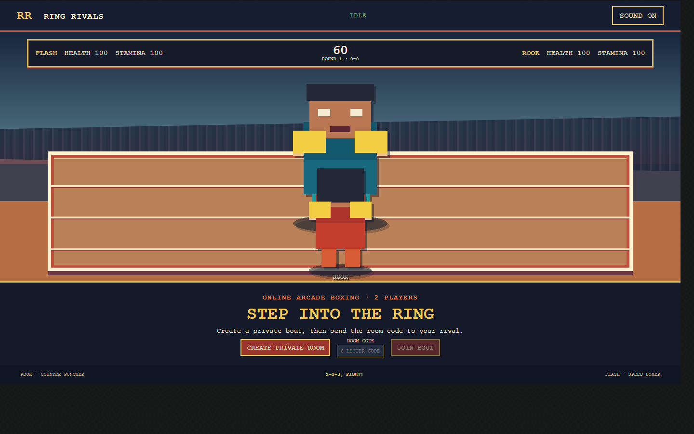

# Ring Rivals

An original 16-bit-style online boxing game for two players, with private invite rooms and a distinct boxer perspective for each client.

## Live Demo

- [Play Ring Rivals](https://samuelasherrivello.github.io/babylon-lite-ring-rivals/)

## Screenshot

<a href="ring-rivals/documentation/screenshot01.png"></a>

## Play

Create a private room and share its six-character code, or enter a friend's code to join. Select Rook or Flash, then both players ready up. Either player may choose either boxer; duplicate choices are allowed.

Each screen keeps its own point of view: your boxer appears smaller in the foreground, seen from behind, while the remote boxer faces you from across the ring. The game uses a fixed 16:9 landscape viewport and fits it inside portrait or landscape browser windows.

### Controls

- `Z` / `X`: jab / cross to the head
- `A` / `S`: jab / cross to the body
- `Up` / `Down`: high / low guard
- `Left` / `Right`: dodge
- Touch players can tap the on-screen action buttons.

Matches use best-of-three 60-second rounds. A knockout ends the round; otherwise higher remaining health wins. Equal health draws the round. A dropped client can recover its seat for 15 seconds; the round clock pauses during recovery. Rooms and matches are temporary and may reset during server deployments.

The live demo uses the shared Colyseus service at `https://rmc-colyseus-multiplayer-server.vercel.app`. It has no accounts or persistent rankings. Add `?mute=1` to the demo URL for a silent session.

## Development

Requires Node.js 24.

```sh
npm ci
npm run dev
npm test
npm run build
```

The game uses the pinned `@rmc/multiplayer-client` 0.9.3 GitHub Release package. The authoritative server validates actions, timing, health, stamina, rounds, and match outcomes. The client buffers timestamped snapshots for remote interpolation, predicts local dodge motion immediately, and eases visual correction back to server state.

## Project Layout

- `ring-rivals/src/content/ring-rivals/` contains the game client and fighter motion interpolation.
- `ring-rivals/src/content/` contains the Babylon Lite/WebGPU content integration.
- `ring-rivals/src/ui/` contains the fixed 16:9 viewport and visual styling.
- `openspec/changes/ring-rivals-multiplayer-game/` contains the game proposal, design, specs, and implementation checklist.
- `ring-rivals/documentation/screenshot01.png` is the current lobby capture.

## Original Prompt and Decisions

The project began from a request for a Street Fighter II clone, then was redirected to an original Mike Tyson's Punch-Out!!-inspired 16-bit boxing game. Subsequent decisions made it online-only, removed couch co-op, fixed one orientation per release (landscape for this game), and required one local perspective per client. The reference links were for gameplay research only; no ROM data, copyrighted game assets, code, branding, or characters are included.
